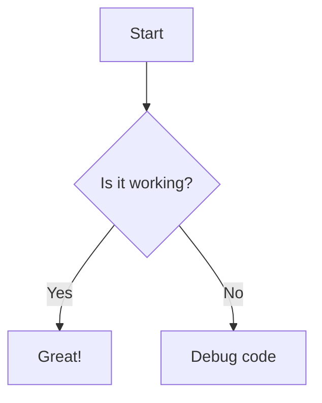

# HeaderWithoutSpace

1. First item
2. Wrong numbered item
   This line has trailing spaces.



```javascript
import { useEffect, useState } from "react";

function UserCard() {
  const [count, setCount] = useState(0);

  if (count > 0) {
    useEffect(() => {}, []); // BUG 1: Violates React Rules of Hooks
  }

  return <div>{user.name}</div>; // BUG 2: "user" is undefined
}
```

```json
{
  "embeddedLanguageFormatting": "auto",
  "proseWrap": "preserve",
  "printWidth": 80,
  "tabWidth": 2,
  "useTabs": false,
  "singleQuote": false
}
```

```json
{
  "item": "ます形（連用形）",
  "rule": "丁寧な叙述表現。動詞連用形は「ます形から『ます』を取り除いた形」と定義される。",
  "conjugation_rules": {
    "1類動詞": "語尾の「う段」仮名を「い段」に変えて「ます」を付ける",
    "2類動詞": "「る」を取り除き、「ます」を付ける",
    "3類動詞・不規則": "くる → きます；する → します"
  },
  "syntax_notes": "動詞連用形（ます形の語幹）は、名詞化や各種複合語・接尾辞形成の基幹となる。",
  "eg": [
    {
      "origin": "明日は図書館で本を読みます。",
      "result": "明天在图书馆读书。"
    },
    {
      "origin": "休みの日には映画を見ます。",
      "result": "休息日看电影。"
    }
  ]
}
```
